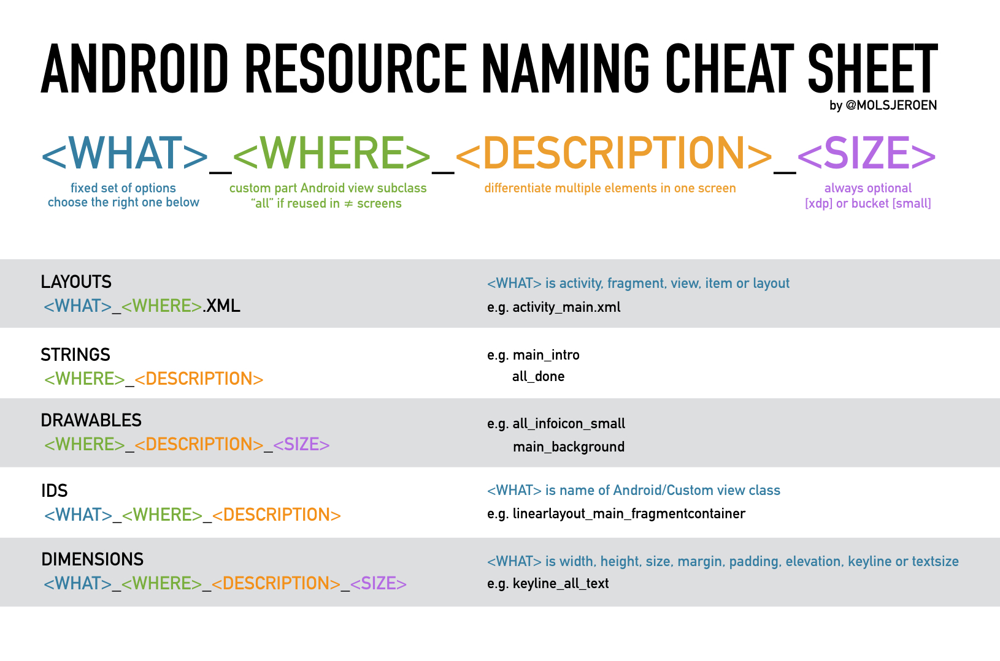

# 命名规则

####基本准则

* \<WHAT\>：表示代表是什么资源，通常是一个标准的View类或者能代表View的类
* \<WHERE\>：表示属于app什么地方，在多个页面使用的资源用all，其他则对应页面名称自定义部分
* \<DESCRIPTION\>：区分同一界面的不同元素
* \<SIZE\>：描述大小的文字（可选） 

####Layout命名规则
 
其中<WHAT>可以是以下名称之一: 
* activity:activity的布局
* fragment:fragment的布局
* view:一个自定义view所要inflated的布局
* item:recyler或者gridview中使用的布局
* layout:include标签中用来重用的布局

 **示例** 
* activity_main: MainActivity的布局
* fragment_articledetail:  ArticleDetailFragment的布局
* view_menu: 被自定义view：MenuView所inflate的布局
* item_article: ArticleRecyclerView中的item
* layout_actionbar_backbutton:带有返回按钮的actionbar的布局

####String命名规则
