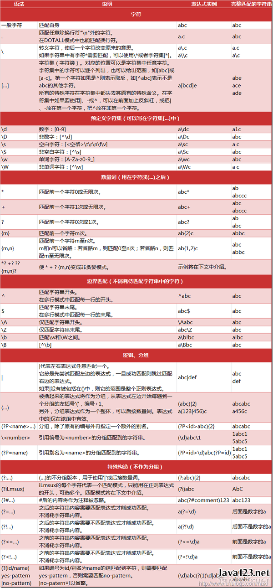
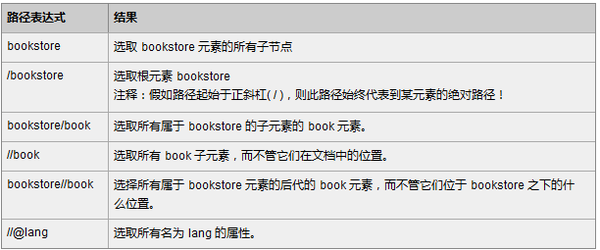

# Python

####网页内容解析
* 正则表达式： 
  

* XPATH 
  

* Beautifulsoup  
      
####学习文档
* [**官方文档**](https://docs.python.org/3/)
* [**相关推荐一**](https://www.zhihu.com/question/20899988)
* [**相关推荐二**](https://www.zhihu.com/question/21358581)

####爬虫案例
* [**豆瓣书籍**](https://github.com/lanbing510/DouBanSpider) 
